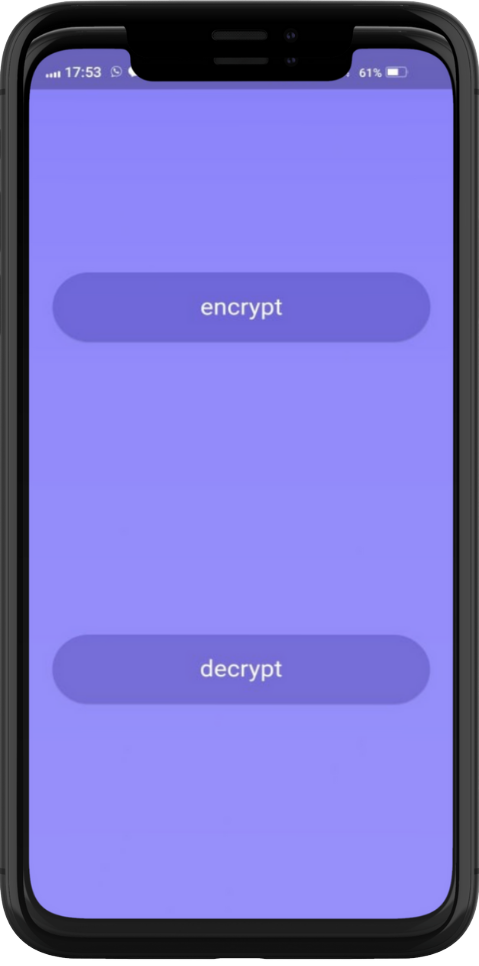
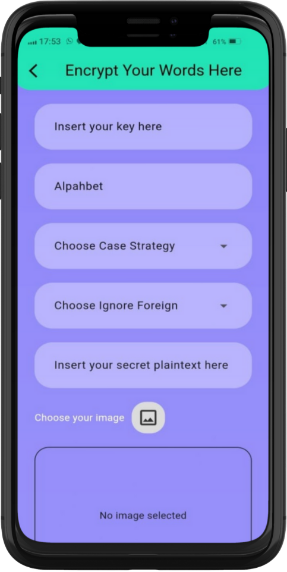
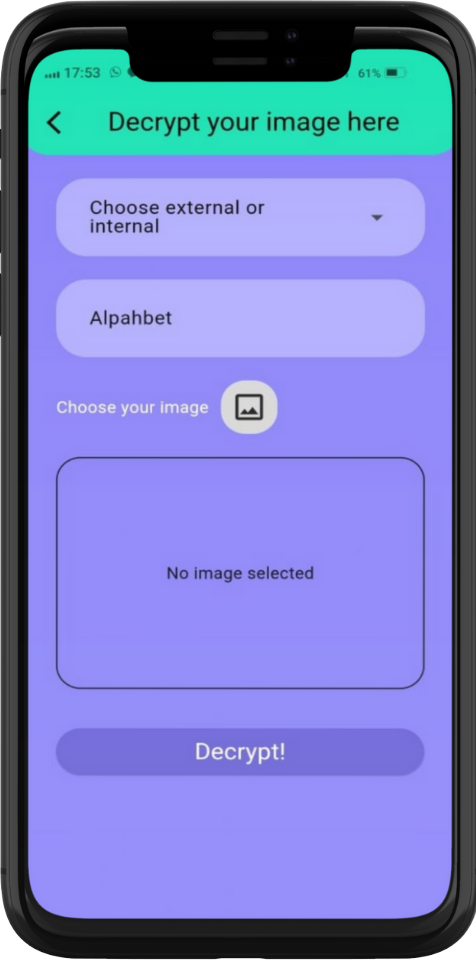

# 🔐 KryptoApp - Secure Message Encryption & Image Steganography

## 📱 Preview

<div style="display: flex; flex-direction: column; align-items: center;">
  
  
  
</div>

## 🌟 Overview

KryptoApp is a powerful mobile application built with Flutter that combines cryptography and steganography to provide secure message hiding capabilities. Our app allows users to encrypt messages, embed them into images, and later decrypt them back to plaintext.

## ✨ Key Features

### 🔒 Encryption Module

- Multiple encryption algorithms support
- Secure key management
- Real-time encryption preview
- Copy encrypted text functionality

### 🖼️ Steganography Module

- Image selection from gallery
- Message embedding into images
- Support for PNG and JPG formats
- Custom embedding algorithms
- Image quality preservation

### 🔓 Decryption Module

- Image-to-text extraction
- Automatic algorithm detection
- Message verification
- Original message recovery

## 🛠️ Technical Stack

- **Framework**: Flutter 3.19.0
- **Language**: Dart 3.0
- **State Management**: Provider/Bloc
- **Storage**: Secure Storage
- **Image Processing**: image_picker, image
- **Cryptography**: cryptography, encrypt
- **CI/CD**: GitHub Actions

## 📲 Installation

```bash
# Clone the repository
git clone https://github.com/yourusername/krypto-app.git

# Navigate to project directory
cd krypto-app

# Install dependencies
flutter pub get

# Run the app
flutter run
```

## 🏗️ Project Structure

```
lib/
├── main.dart
├── API/
│   ├── eksternal/
│   │   ├── request_deskrip_api.dart
│   │   └── request_enkrip_api.dart
│   └── models/
│       ├── model_enkrip.dart
│       └── model_dekrip.dart
│
└── contents/
    ├── dashboard/
    │   ├── widgets/
    │   │   └──  buttonnext.dart
    │   └── home.dart
    │
    ├── decrypt/
    │   ├──  decrypt.dart
    │   └──  result_decrypt.dart
    │
    └── encrypt/
        ├──  encrypt.dart
        └──  result_encrypt.dart
```

## 🔍 How It Works

### Encryption Process

1. User inputs plaintext message
2. Selects encryption key
3. Message is encrypted using selected key
4. Encrypted text is ready for steganography

### Steganography Process

1. User selects image from gallery
2. Encrypted message is embedded into image
3. Modified image is saved to gallery and can share
4. Original image quality is preserved

### Decryption Process

1. User selects steganographic image
2. App extracts hidden encrypted message
3. Message is decrypted automatically
4. Original plaintext is displayed

## 🚀 Getting Started

1. Launch KryptoApp
2. Navigate to Encryption page
3. Enter your message
4. Select encryption method
5. Choose image for steganography
6. Save encrypted image
7. Use Decryption page to recover message

## 📝 Dependencies

```yaml
dependencies:
  flutter:
    sdk: flutter
  cupertino_icons: ^1.0.8
  dropdown_textfield: ^1.2.0
  image_picker: ^1.1.2
  path_provider: ^2.1.5
  share_plus: ^10.1.3
  http: ^1.2.2
  path:
  mime: ^2.0.0
  http_parser: ^4.0.2
```

## 📱 Supported Platforms

- Android 5.0+
- iOS 11.0+

## 🐛 Known Issues

- Large images may take longer to process
- Some emoji characters may not be supported in encryption
- Maximum message length depends on image size

## 📧 Contact & Support

- Email: wildan27370@gmail.com
- GitHub Issues: [Create an issue](https://github.com/yourusername/krypto-app/issues)

## 🙏 Acknowledgments

- Flutter team for the amazing framework
- Cryptography library contributors
- Image processing library maintainers
- Our amazing community of users and contributors

---

Made with ❤️ by Wilimaxs Team
